## 🔈상세 화면

### 로그인/회원가입

| 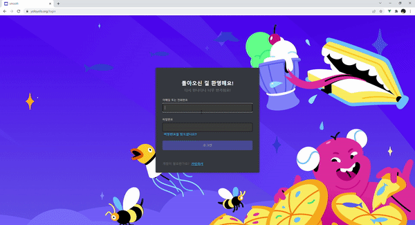 |  |
| -------------------------------------------- | ------------------------------------------------- |
| 로그인                                       | 회원가입                                          |

 

### 친구관리

| 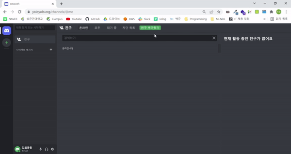 | 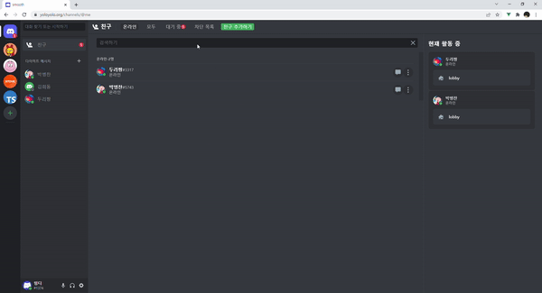 | 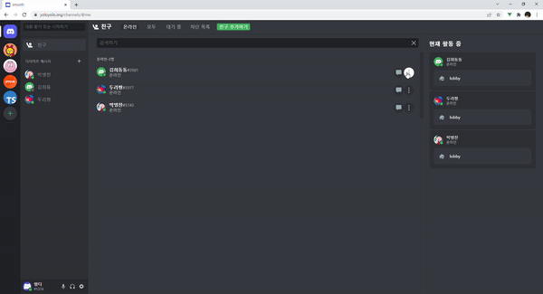 |
| ----------------------------------------------------- | -------------------------------------------------------- | ------------------------------------------------------- |
| 친구추가                                              | 친구수락                                                 | 친구차단                                                |

 

### 친구 추가기능

|  | 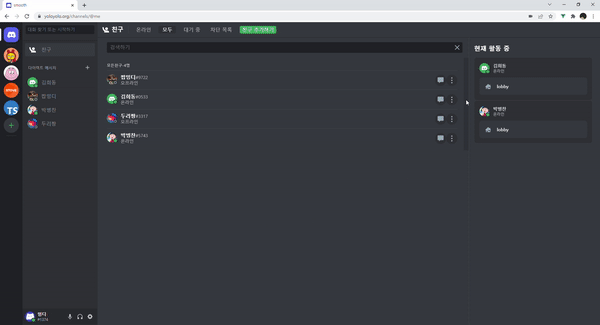 |
| ----------------------------------------------------------------------------- | ------------------------------------------------------------------ |
| 친구에게 메시지 걸기                                                          | 친구에게 전화걸기                                                  |

 

### DM

| 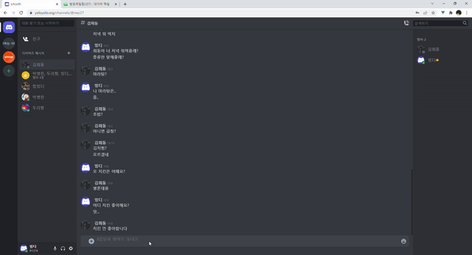 |  | 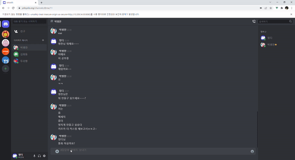 |
| ------------------------------------------------------------- | --------------------------------------------------------- | ------------------------------------------------------------------ |
| 1:1DM                                                         | 그룹DM                                                    | DM 통화 및 채팅                                                    |

### 메시지 알림

|  | 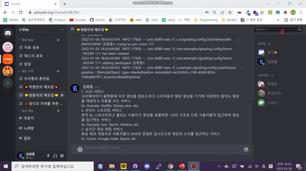 |
| ----------------------------------------------------- | ---------------------------------------------------- |
| DM UI                                                 | DM FCM                                               |

### 커뮤니티 초대

|  | 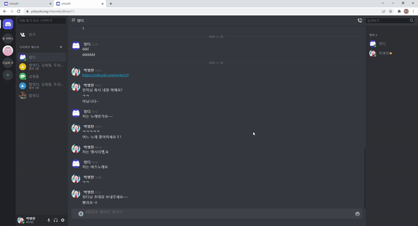 |
| ----------------------------------------------------------- | ---------------------------------------------------------------------- |
| 초대하기                                                    | 초대받고 커뮤니티 입장하기                                             |

### 커뮤니티

| 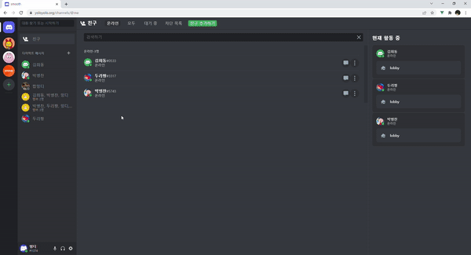 |  | 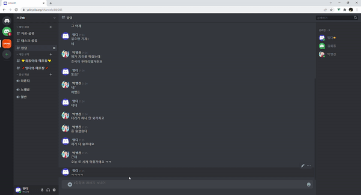 |
| ------------------------------------------------------------------------------------------------- | ----------------------------------------------------------------------- | ------------------------------------------------------------------------------------ |
| 커뮤니티,카테고리, 채널 생성하기, drag and drop                                                   | 커뮤니티,카테고리, 채널 편집, 수정하기                                  | 커뮤니티 자유로운 채팅                                                               |

### 실시간 상태 관리

| 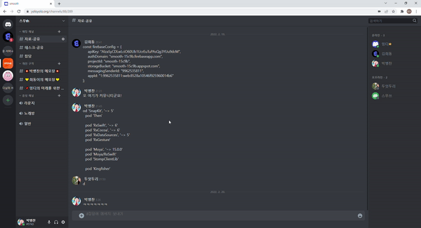 | 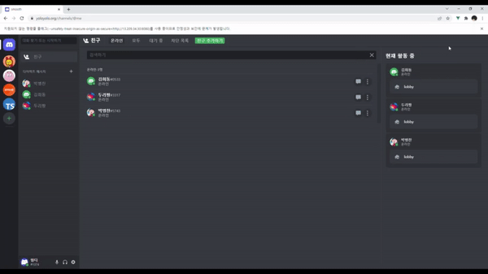 | 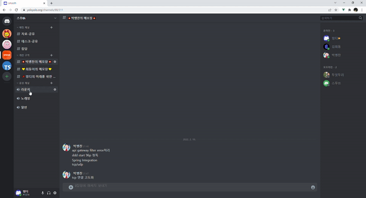 |
| -------------------------------------------------------- | -------------------------------------------------------------- | ----------------------------------------------------------------------- |
| 타이핑 상태                                              | 내친구의 활동상태                                              | 음성채널 참가 멤버                                                      |

| 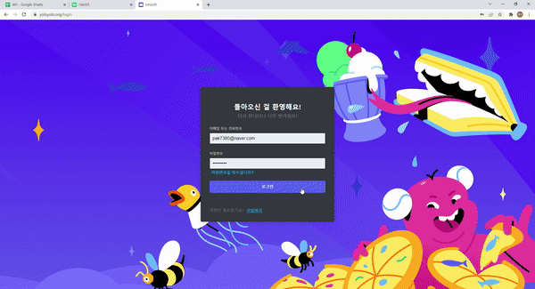 | 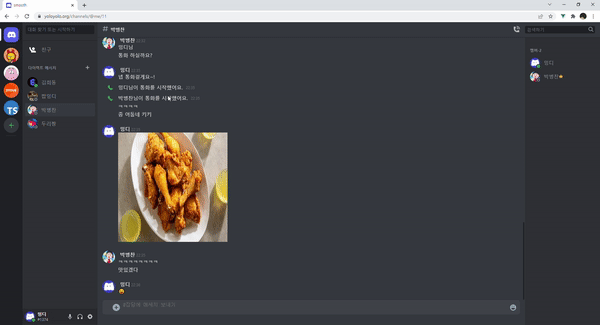 | 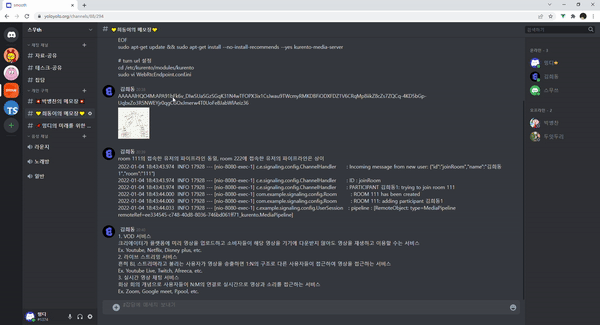 |
| ------------------------------------------------------------------ | ----------------------------------------------------------------------- | ------------------------------------------------------------------------------------- |
| smooth 접속                                                        | dm방에서 멤버 접속 확인                                                 | 커뮤니티 채팅방 멤버 접속 확인                                                        |
