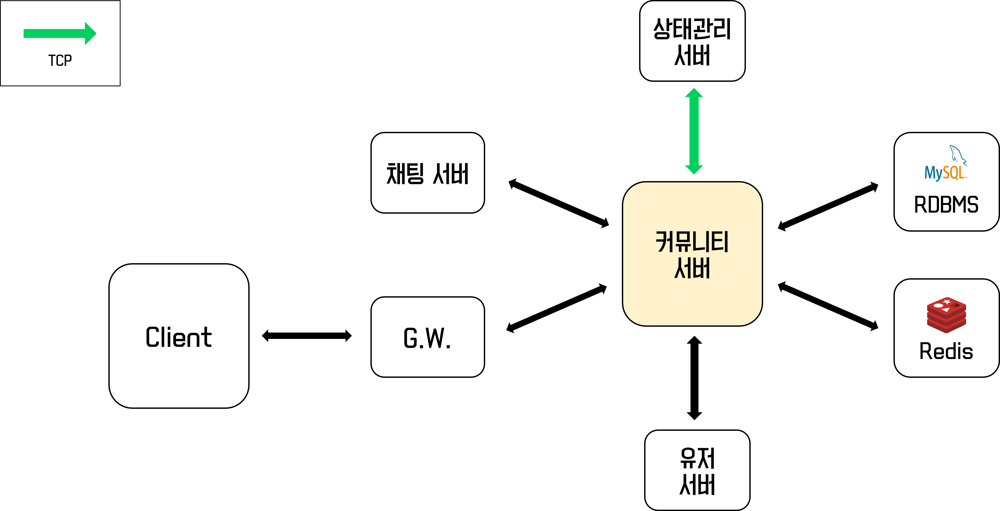

# 커뮤니티 서버
## 역할
|서비스|역할|
|---|---|
|커뮤니티 서버|디스코드 내에서 제공하는 커뮤니티 및 채널에 대한 관리 기능 담당|

## 기술스택
- Java 11
- Springboot 2.6.2
- Spring Data JPA
- Spring Cloud
- WebSocket, SockJS
- Spring Integration TCP/UDP
- MySQL
- Redis

## 아키텍처


## 제공 기능
|기능|설명|
|---|---|
|커뮤니티 관리 기능|- 커뮤니티, 채널에 대한 조회, 생성, 수정, 삭제 기능 제공<br>- 사용자 별 커뮤니티 배치 위치 설정 기능<br>- 채널 순서 위치 변경 기능 제공|
|커뮤니티 초대 기능|- 초대장 생성 및 초대장을 통한 가입 기능 제공|

## 구현
### 1. 도메인 설계
- 커뮤니티-카테고리-채널로 이어지는 계층적인 관계에서 상위 계층에서 퇴장 및 차단이 발생할 시 하위 계층의 명단에서도 제거되고, 같은 깊이의 계층에서 소속된 사용자의 수나 구성원이 달라질 수 있는 상황이 존재
- 접근 권한이 없는 유저의 접속을 제어하기 위한 예외 처리와 상위 계층에서 퇴장/차단 기능이 작동될 때 <b>엔티티 내에 비즈니스 메서드를 추가</b>하여 하위 계층에 저장된 구성원의 상태까지 함께 관리하는 로직을 구현
- 또한 사용자가 커뮤니티 및 채널의 <b>배치 순서를 자유롭게 이동</b>할 수 있는 기능을 제공하기 때문에 <b>최대한 적은 수의 채널이 영향을 받게 하면서</b> 위치를 자유롭게 변경할 수 있는 기능을 구현

### 2. 사용자의 접속 상태 동기화
- 커뮤니티에 접속한 사용자들의 목록을 제공하기 위해 상태관리 서버로부터 <b>사용자들의 접속 상태를 동기화</b>
- 사용자가 접속하거나 종료하는 이벤트가 발생될 때 <b>상태관리 서버로부터 TCP 연결을 통해 해당 정보를 업데이트</b>

    ```java
    // /service/MessageService.java
    public class MessageService {
        ...
        // 상태관리 서버에서 유저 로그인/로그아웃 이벤트 발생 시 메세지 수신
        public String processMessage(String message) {
            try {
                String[] userState = message.split(SEP);
                Long userId = Long.parseLong(userState[0]);
                String state = userState[1].equals(ONLINE) ? ONLINE : OFFLINE;
                UserStateUtil.status.put(userId, state);
            } catch (Exception e) {
                log.error("PRESENCE UPDATE BY TCP ERROR");
            } finally {
                return DEFAULT_RESPONSE;
            }
        }
    }
    ```
- 추가로 값의 <b>무결성을 위해 6시간 주기로 전체 사용자 접속 상태를 불러와서 동기화</b> 진행
    ```java
    // /util/UserStateUtil.java
    public class UserStateUtil {
        ...
        public static ConcurrentMap<Long, String> status = new ConcurrentHashMap<>();
        ...
        @Scheduled(fixedDelay = FULL_QUERY_INTERVAL)
        public void updateAllUserState() {
            log.info("UPDATE USER STATE");
            // 상태관리 서버에서 접속한 모든 유저 정보 조회
            ConcurrentMap<Long, String> presenceState = presenceClient.getUserState();
            // status 바꿔주기
            try {
                status = presenceState;
            } catch (Exception e) {
                // 에러 발생 시 기존 state 유지
                log.error("PRESENCE SERVER ERROR");
            }
        }
    }
    ```

## 프로젝트 진행 중 이슈
### 도메인 설계
- 디스코드는 <b>커뮤니티 기반의 메신저 프로그램
- 사용자의 모든 활동은 커뮤니티 기반으로 진행

    

- 사용자간의 개인 DM 또는 그룹 DM 기능까지도 사용자간의 채널을 만들어 채팅 또는 활동을 제공
- 추가적으로 커스터마이징 기능이 있어서 도메인 설계 후 엔티티 내에 채널의 순서를 바꾸거나 상위 그룹에서 소속된 사용자에 변동이 있는 경우 서비스 코드의 복잡도가 증가할 수 있기 때문에 <b>엔티티 내에 최대한 비즈니스 메서드</b>를 추가해서 서비스 코드의 복잡성을 낮추고자 함.

---

### MSA 관점에서 커뮤니티 서버의 설계?
- 기능에 따라 서비스들을 분리해서 개발
- 오히려 하나의 기능을 제공하기 위해 여러 서비스에 많은 요청을 해야하는 상황 발생

    

- 아래 화면처럼 사용자의 접속 정보를 제공하기 위해 상태관리 서버를 통해 사용자의 접속 정보를 조회해야하는 상황에서 API가 요청될 때마다 상태관리 서버에서 값을 조회하는 것은 비효율적이라고 판단

    

- <b>상태관리 서버와 TCP 연결</b>을 통해 온라인, 오프라인 <b>이벤트가 있는 경우 값을 최신화</b>해주고, 값의 <b>무결성을 위해 6시간 주기로 전체 접속 정보를 Full Query</b> 진행

    

---    

### 시그널링 서버에 연결해야 할 주소 제공
- API gateway를 이용하여 시그널링 서버를 연결하는 경우 API gateway에 부하가 생기고, 서버의 사용량이나 상태에 따른 밸런싱을 처리하기 어려움
    - 디폴트 알고리즘은 RR 방식을 사용한다고 해도 현재의 사용량(ex. 웹소켓이 연결되어 있는 수)에 따른 적절한 분배가 어려움
    - 또한 gateway에 분배를 위한 비즈니스 로직을 추가하는 것도 적절하지 않다고 판단
- 따라서 클라이언트에서 직접 시그널링 서버로 웹소켓 연결을 하는 방향을 선택했고, 그것을 위해서 시그널링 서버의 사용량이나 접속 상태에 따라 어떤 시그널링 서버로 접근해야 하는지 알려주는 API를 개발

    
---

### 재사용성이 높은 코드 작성
- 커뮤니티, 카테고리, 채널 CRUD 등 반복되는 기능이 많기 때문에 코드의 재사용성을 높이기 위해 노력

    

- 코드 중복을 5% 미만으로 줄이고자 노력함

---
## 관련 자료
- [마이크로서비스 간 메세징 처리](https://github.com/stove-smooth/messaging)
>- spring integration reference guide : https://docs.spring.io/spring-integration/reference/html/
>- spring integration tcp/udp support : https://docs.spring.io/spring-integration/reference/html/ip.html#ip
>- spring integration introduction (baeldung) : https://www.baeldung.com/spring-integration
>   - adapter (endpoint summary) : https://docs.spring.io/spring-integration/docs/5.1.0.M1/reference/html/endpoint-summary.html
>   - tcp adapter : https://docs.spring.io/spring-integration/docs/5.1.0.M1/reference/html/ip.html#tcp-adapters
>   - web socket adapter : https://docs.spring.io/spring-integration/docs/5.1.0.M1/reference/html/web-sockets.html#web-socket-inbound-adapter
>- spring integration tutorial : https://github.com/eugenp/tutorials/tree/master/spring-integration
>- spring integration keyword : https://www.linkedin.com/pulse/spring-boot-spring-integration-baki-hayat
>- spring integration example : https://github.com/spring-projects/spring-integration-samples
>    - https://github.com/spring-projects/spring-integration-samples/blob/main/advanced/dynamic-tcp-client/src/main/java/org/springframework/integration/samples/dynamictcp/DynamicTcpClientApplication.java
> - spring integration transaction : https://www.baeldung.com/spring-integration-transaction
>- TCP 서버 만들기
>    - server : https://gogo-jjm.tistory.com/57
>    - client : https://gogo-jjm.tistory.com/58?category=854015
>- TcpSendingMessageHandler 예제 : http://useof.org/java-open-source/org.springframework.integration.ip.tcp.TcpSendingMessageHandler
>- 패킷 유실 시 TCP/UDP 현상 : https://thebook.io/006884/ch02/07/
---
- MessageTimeoutException: Timed out 에러
    ```
    o.s.i.ip.tcp.TcpOutboundGateway          : Tcp Gateway exception
    org.springframework.integration.MessageTimeoutException: Timed out waiting for response
    ```
    - https://stackoverflow.com/questions/42667403/spring-integration-tcp