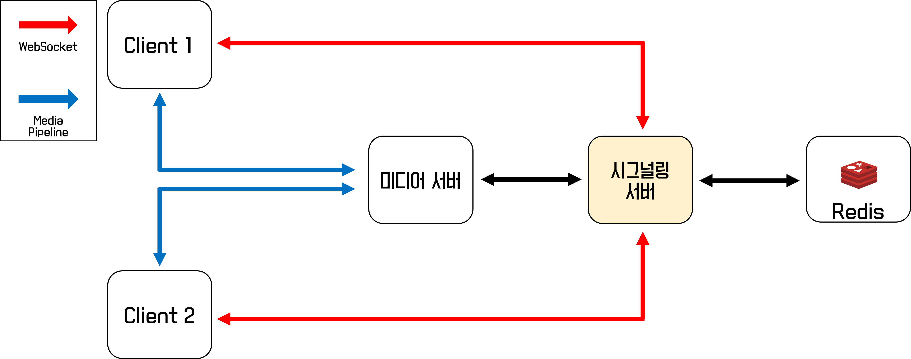

# 시그널링 서버
## 역할
|서비스|역할|
|---|---|
|시그널링 서버|- WebRTC 화상채팅을 제공하기 위해 클라이언트간 정보를 전달<br>- 사용자의 엔트포인트를 미디어 서버로 연결해주는 기능을 담당|
|미디어 서버|클라이언트의 부하(uplink)를 줄이기 위해 미디어 서버를 연결하여 중계|

## 기술스택
- Java 11
- Springboot 2.6.2
- WebSocket, SockJS
- Spring Integration TCP/UDP
- Kurento Media Server 6.16
- Kurento Client
- Redis

## 아키텍처


---

## 제공 기능
|기능|설명|
|---|---|
|클라이언트 정보 전송 |WebRTC를 위해 필요한 사용자들의 SDP 및 ICE Candidate 정보 전달|
|방 관리 기능|- 웹소켓 설정을 통해 방 입장 및 퇴장을 관리<br>- 이벤트가 발생했을 때 해당 방의 사용자에게 웹소켓을 통한 메시지 전송 및 상태관리 서버로 TCP연결을 통해 해당 정보 전송<br>- 입장한 방에 따라 미디어 서버 파이프라인 연결|

## 구현
### 1. 웹소켓 메시지 핸들링
- 방 입장, 정보 전송, 퇴장, 설정 변경에 대한 메시지를 핸들링하고 방에 입장 및
퇴장시킵니다.
- [MessageHandler.java](./src/main/java/com/example/signalingserver/service/MessageHandler.java)
    ```java
    // /service/MessageHandler.java
    public class MessageHandler extends TextWebSocketHandler {
        ...
        public void handleTextMessage(WebSocketSession session, TextMessage message) {
            final JsonObject jsonMessage = gson.fromJson(message.getPayload(), JsonObject.class);
            ...
            switch (jsonMessage.get(ID).getAsString()) {
                // 방 접속
                case JOIN:
                    ...
                    join(joinRequest, session);
                    break;
                // SDP 정보 전송
                case RECEIVE_VIDEO_FROM:
                    ...
                    user.receiveVideoFrom(sender, sdpOffer);
                    break;
                // ICE Candidate 정보 전송
                case ON_ICE_CANDIDATE:
                    ...
                    user.addCandidate(cand, candidateRequest.getUserId());
                    break;
                // 비디오 설정 변경
                case VIDEO_STATE_FROM:
                    ...
                    updateVideo(videoStateRequest, user);
                    break;
                // 오디오 설정 변경
                case AUDIO_STATE_FROM:
                    ...
                    updateAudio(audioStateRequest, user);
                    break;
                // 방 나가기
                case LEAVE:
                    leave(user);
                    break;
                default:
                    break;
            }
            ...
        }
        ...
    }
    ```
- [메세지 타입 정의](https://github.com/stove-smooth/sgs-smooth/wiki/시그널링-서버-메세지-타입)

### 2. 방 관리 및 접속 정보 저장
- 방에 입장 시 방의 존재 유무를 확인합니다.
    - 방이 존재하는 경우 기존 방에 설정된 미디어 파이프라인을 사용자의 엔드포인트로 설정합니다.
    - 방이 존재하지 않는 경우 새로운 방 정보 및 미디어 파이프라인을 생성합니다.
- [RoomManager.java](./src/main/java/com/example/signalingserver/util/RoomManager.java)
    ```java
    // util/RoomManager.java
    public class RoomManager {
        private final KurentoClient kurento;
        ...
        public Room getRoom(String roomId, String communityId) {
            Room room = rooms.get(roomId);
            if (room == null) {
                // 방이 없는 경우 새로운 미디어 파이프라인 생성
                room = new Room(roomId, kurento.createMediaPipeline(), communityId);
                rooms.put(roomId, room);
            }
            return room;
        }
        ...
    }
    ```
- 모든 방 정보 및 접속 정보를 메모리로 관리하는 경우 확장성에 문제가 있기 때문에 Redis를 이용하여 접속 정보를 저장합니다.
- 추가적으로 입/퇴장 시 서버에 접속한 사용자의 수를 증가/감소시켜서 서버별 연결된 웹소켓 수를 파악하고, 이후에 방에 따른 서버 연결 혹은 방이 존재하지 않는 경우 사용량이 적은 서버로 연결시킵니다.
    ```java
    // service/MessageHandler.java
    private void join(JoinRequest request, WebSocketSession session) throws IOException {
        ...
        Room room = roomManager.getRoom(roomId, communityId);
        ...
        ValueOperations<String, String> valueOperations = redisTemplate.opsForValue();
        valueOperations.set(roomId + PIPELINE, room.getPipeLineId(), TIME, TimeUnit.MILLISECONDS);
        ...
        SetOperations<String, String> setOperations = redisTemplate.opsForSet();
        setOperations.add(roomId, userId);
        setOperations.add(SERVER + IP, roomId);
        ...
    }
    ```

- 방에서 퇴장할 경우 상태관리 서버로 이벤트를 전송하기 위해 TCP connection을 통해 해당 정보를 전송합니다.
    - 디스코드는 로그인 시에 채팅 및 실시간 이벤트 처리를 위해 웹소켓(채팅서버)이 연결됩니다.
    - 그리고 화상채팅을 이용할 경우 추가적인 웹소켓(시그널링서버)을 연결합니다.
    - 시그널링 서버에 연결되어 있는 사용자의 경우 시그널링 서버의 웹소켓을 통해 이벤트를 전달할 수 있지만 화상채팅을 이용하지 않는 외부의 워크스페이스에 존재하는 사용자들에게 이벤트를 전달하기 위해서는 기존 웹소켓(채팅서버)을 통해 메세지를 전달해야 합니다.
    - 따라서 시그널링 서버-상태관리 서버, 채팅서버-상태관리 서버를 각각 TCP 연결한 후 이벤트에 대한 메세지를 전송하는 방법으로 기능을 구현했습니다.

    ```java
    // service/MessageHandler
    @Override
    public void afterConnectionClosed(WebSocketSession session, CloseStatus status) throws Exception {
        UserSession user = registry.removeBySession(session);
        roomManager.getRoom(user.getRoomId(), user.getCommunityId()).leave(user);

        // 상태관리 서버로 퇴장 정보 전송
        StateRequest logoutRequest = new StateRequest(State.DISCONNECT, user.getUserId(), user.getCommunityId(), user.getRoomId());logoutRequest.toString());
        tcpClientGateway.send(logoutRequest.toString());
    }
    ```
---

## 작동 화면
- 클라이언트와 연결 전 미디어 서버, TURN 서버 설정을 마친 후 자체적으로 실행시킨 데모 화면입니다.


## 프로젝트 진행 중 이슈
### EC2로 배포 시 브라우저에서 일정 시간 이후 웹소켓 세션이 끊어지는 현상
- EC2로 배포하는 경우 실제 웹소켓이 끊어지지는 않지만 아무런 동작이 없는 경우 브라우저 단에서 연결을 제한하는 문제가 발생
- 이에 대한 해결방법으로 여러 가지 방법을 고민해볼 수 있음

> 1. 현재 프로젝트에서 활용하고 있는 방법인 `SockJS`를 활용하는 방법
- 사용자가 아무런 동작을 하지 않기 때문에 연결이 제한되는 것이기에 `heartbeat`를 주기적으로 보내서 연결이 제한되지 않게 막는다.
- 이전 프로젝트에서 `Socket.io`를 활용하여 프로젝트 진행 및 배포를 진행했을 때 연결이 제한되지 않았는데 확인해보니 `Socket.io`에서는 연결을 유지하기 위해 `heartbeat`를 보내는 것을 알게 되었다.
- 보통 Spring에서 채팅을 구현할 때 SockJS, STOMP 조합을 통해 채팅을 구현하게 되는데 이 때 WebSocketMessageBroker 설정 파일 및 엔드포인트를 설정할 때 기본값으로 `heartbeat` 옵션이 들어간다. 

> 2. ELB를 활용해서 Session Timeout을 최대로 설정해주는 방법
- 이 방법을 활용할 경우 아무런 동작을 행하지 않더라도 최대 4000초까지 연결이 제한되지 유지될 수 있음

### Web View 관련

> 1. 아이폰에서 재생시킬 때에는 `video` 태그의 옵션에 `playsinline` 속성을 추가하자
- 지원하는 플랫폼 중 iOS에서 native하게 개발이 불가능하다는 의견을 들어서 모바일 버전의 web view를 준비했다.
- 이 때 모바일 브라우저로 접근할 때 유일하게 아이폰(아이패드는 정상 작동)만 본인의 미디어 스트림은 정상적으로 송출하는데 외부(remote)의 스트림을 수신한 후 재생하지 못 하는 현상이 발생했다.
- 확인해보니 아이폰에서는 `video` 태그에 `playsinline` 속성이 없는 경우 재생이 되지 않는다고 한다. 
- playsinline 속성을 추가한다면 정상적으로 수신 및 재생 가능했다.

> 2. `Firebase SDK`
- 우리는 Web에서 Push 기능을 제공하기 위해 Firebase Cloud Messaging 기능을 이용했다.
    - 플랫폼 별로 따로 관리할 필요없이 대부분의 플랫폼에 대해 Push 기능을 제공하고 러닝커브없이 사용할 수 있기 때문에 FCM을 선택했다.
- 따라서 Firebase SDK를 포함한 Vue 프로젝트를 빌드한 후 배포한 상황이었는데 이 웹 페이지를 모바일 환경에서 접근하는 경우 <b>흰 페이지</b>만 렌더링되었다.
- 확인해보니 모바일 환경에서 Firebase SDK를 포함한 웹페이지를 접근하는 경우 에러가 발생한다는 것을 알았고, Web View를 제공하지 않는다면 별도의 모바일 페이지를 제작하지 않아도 괜찮지만 Web View를 제공하기 위해 Firebase SDK가 포함되지 않은 별도의 버전을 빌드해서 배포했다.


### 성능 측정
- 우리 프로젝트에서 한 음성 채널의 최대 인원 수는 25명이다.
- 아래 성능 측정은 20명이 하나의 음성채널에 접속했을 때 크롬에서 지원하는 webrtc-internals를 통해 FPS 또는 packet loss를 측정한 결과이다.


- 추가적으로 NHN에서 [WebRTC 서비스 부하 테스트](https://forward.nhn.com/2021/sessions/2)와 관련한 영상 세션을 확인할 수 있는데 조금 더 이른 시간에 영상의 존재를 알았다면 추가적으로 실험이 가능했을 것으로 예상된다.

---
## 관련 자료
- [WebRTC를 선택한 이유](https://github.com/stove-smooth/sgs-smooth/wiki/WebRTC%EB%A5%BC-%EC%84%A0%ED%83%9D%ED%95%9C-%EC%9D%B4%EC%9C%A0)
- [WebRTC 기반 서비스를 지원하기 위한 서버의 종류](https://github.com/stove-smooth/sgs-smooth/wiki/WebRTC-%EA%B8%B0%EB%B0%98-%EC%84%9C%EB%B9%84%EC%8A%A4%EB%A5%BC-%EC%A7%80%EC%9B%90%ED%95%98%EA%B8%B0-%EC%9C%84%ED%95%9C-%EC%84%9C%EB%B2%84%EC%9D%98-%EC%A2%85%EB%A5%98)
- [미디어 서버 선택하기](https://github.com/stove-smooth/sgs-smooth/wiki/%EB%AF%B8%EB%94%94%EC%96%B4-%EC%84%9C%EB%B2%84-%EC%84%A0%ED%83%9D%ED%95%98%EA%B8%B0)
- [Kurento 설치 및 설정](https://github.com/stove-smooth/sgs-smooth/tree/develop/docs/reference/kurento)
- Chrome에서 WebRTC 스트림 값 확인 : chrome://webrtc-internals/
- [remote stream 오디오 레벨 확인](https://github.com/stove-smooth/signaling/wiki/Remote-stream-%EC%98%A4%EB%94%94%EC%98%A4-%EC%82%AC%EC%9D%B4%EC%A6%88-%ED%99%95%EC%9D%B8)

## 참고
- Kurento tutorial : https://github.com/Kurento/kurento-tutorial-java
- WebRTC - 시그널링 과정 : https://andonekwon.tistory.com/71
- 시그널링 서버 만들기 : https://withseungryu.tistory.com/130
- kurento 설명 : https://gh402.tistory.com/43
- kurento window 환경에서 실행 : https://gh402.tistory.com/44?category=935378