# 🔈Smooth

<p align="center"></p>

<div align="center">
  
  
  
  <br>
  
  
</div>

<br>

## 🔈배포 주소

[https://yoloyolo.org/](https://yoloyolo.org/)

 <br>

## 🔈대표 실행화면


<br>

## 🔈프로젝트 소개

```
스무스는 디스코드의 주요 기능을 클론코딩한 프로젝트입니다.

소규모 CRUD 프로젝트만 경험해본 상태에서 대규모 실시간 서비스 개발을 위한 다양한 기능의 사용을 경험해 보고싶어 도전하였습니다.
https://yoloyolo.org/
```

## 🔈핵심 기능 소개

### Kurento Utils 라이브러리 사용

WebRTC와 서버 간의 상호 작용을 단순화하는 javascript 라이브러리

구현 - 시그널링 메세지 수신 부분

```javascript

context.state.ws.onmessage = function (message) {
  let parsedMessage = JSON.parse(message.data);
  context.dispatch("onServerMessage", parsedMessage);
};

onServerMessage(context, message) {
  switch (message.id) {
    case "existingParticipants": {//음성방에 참가할 경우
      context.dispatch("onExistingParticipants", message);
      break;
    }
    case "newParticipantArrived": {//음성방에 새 참가자가 올 경우
      context.dispatch("onNewParticipant", message);
      break;
    }
    case "participantLeft": {//음성방에서 참가자가 나갈 경우
      context.dispatch("onParticipantLeft", message);
      break;
    }
    case "receiveVideoAnswer": {//SDP 정보 수신
      context.dispatch("receiveVideoResponse", message);
      break;
    }
    case "iceCandidate": {//ICE Candidate 정보 수신
      context.state.participants[message.userId].rtcPeer.addIceCandidate(
        message.candidate,
        function (error) {
          if (error) {
            console.error("Error adding candidate: " + error);
            return;
          }
        }
      );
      break;
    }
    case "videoStateAnswer": {//참가자 비디오 설정 변경
      context.dispatch("videoStateTranslated", message);
      break;
    }
    case "audioStateAnswer": {//참가자 오디오 설정 변경
      context.dispatch("audioStateTranslated", message);
      break;
    }
    default: {
      console.error("Unrecognized message" + message);
    }
  }
},
```

- [메세지 타입 정의](https://github.com/stove-smooth/sgs-smooth/wiki/시그널링-서버-메세지-타입)

## 🔈프로젝트 진행 중 이슈

### 실시간 채팅 이슈

1.  소켓 연결을 했음에도 구독한 메시지를 받을 수 없는 현상

- socket의 연결이 true가 되면, 구독한 메시지를 받을 수 있게끔 구현하였습니다. 로그인 직후 socket이 true가 되는데, 그 후에 네비게이션바를 통해 커뮤니티 채팅에 입장하니 구독한 메시지를 바을 수 없는 상황이 되었습니다.

```javascript
export const router = new VueRouter({
  mode: "history",
  routes: [
    {                                 //로그인 전
      path: "/login",
      name: "LoginPage",
      component: LoginPage,
    },
    {                                 //로그인 후
      path: "/",
      name: "MainPage",
      component: MainPage,
      children: [
        {
          component
        },
        ...
```

- 기존에 모든 라우트가 같은 level에 있는 단순 라우트 구조에서 트리 구조로 라우트 구조를 변경하였습니다.
- mainPage와 그 아래 페이지들은 로그인 후에만 입장이 가능하게 해서 로그인 전/후를 확실히 분리하였고, mainPage 아래 page로 입장시 구독한 메시지를 받을 수 있게 되었습니다.
- 또한, mainPage에 socket이 연결되었을때만 자식page가 렌더링되게 하여 socket이 연결되기 전에 채팅 페이지가 렌더링되어 채팅이 되지 않는 현상을 해결하였습니다.

2. 이미지 채팅 불러온 후, 스크롤바가 아래로 가지 않는 현상

- 처음 채팅방 입장시 이미지 채팅 크기만큼 스크롤바가 아래로 가지 않는 현상이 있었습니다.
- 이 문제는 채팅 데이터를 받더라도 이미지 링크를 이미지로 변환하는데 별도의 통신이 발생되기에 발생하는 문제였습니다.
- 이미지 로딩이 완료되기 전, 이미지 크기만큼 스켈레톤 영역을 두어 이 문제를 해결하였습니다.

### 실시간 화상 통화 이슈

1. 시그널링 메시지 전송, 수신 및 음성방 참가자 관리 이슈

- 시그널링 메시지를 전송 및 수신을 하며 참가자 관리를 어떻게 할 수 있을지 고민하였습니다.
- 관련 로직을 Vuex에 등록하여, 시그널링 메시지 송수신에 따른 참가자 관리를 원할하게 하였습니다.
- 그래서 참가자가 변할 때마다 참가자 수를 고려하여 화면에 참가자들을 적절히 배치할 수 있었습니다.

2. 비디오, 오디오 장치 변경 이슈

- 기존의 Kurento Utils 사용으로는 다른 참가자의 비디오, 오디오 변경을 인지할 수 없었습니다.
- 비디오, 오디오에 관한 시그널링 메시지를 추가하여 사용자가 카메라와 오디오를 껐을 때의 화면 처리를 할 수 있게 되었습니다.

## 🔈상세 화면

### 로그인/회원가입

| 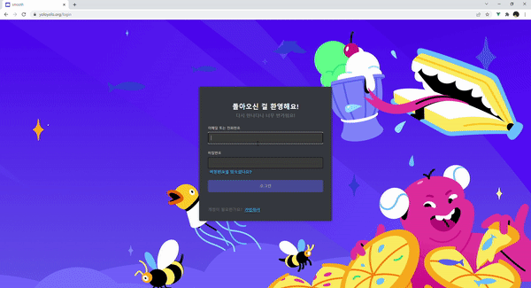 |  |
| ----------------------------------------- | ---------------------------------------------- |
| 로그인                                    | 회원가입                                       |

<br>

### 친구관리

| 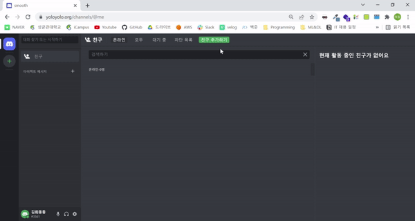 | 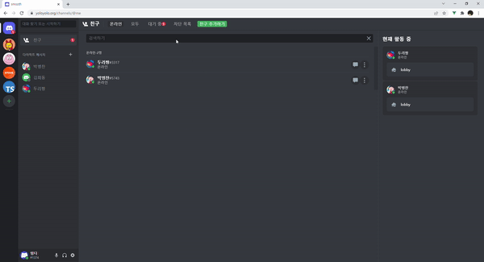 | 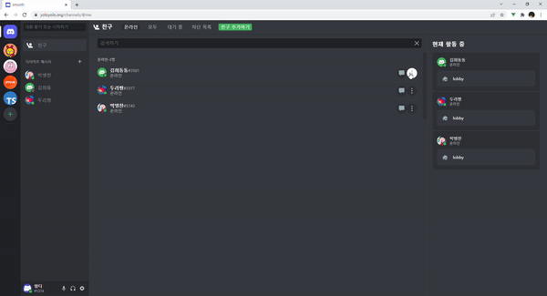 |
| ------------------------------------------------ | --------------------------------------------------- | -------------------------------------------------- |
| 친구추가                                         | 친구수락                                            | 친구차단                                           |

<br>

### 친구 추가기능

|  |  |
| ------------------------------------------------------------------------ | ------------------------------------------------------------- |
| 친구에게 메시지 걸기                                                     | 친구에게 전화걸기                                             |

<br>

### DM

|  | 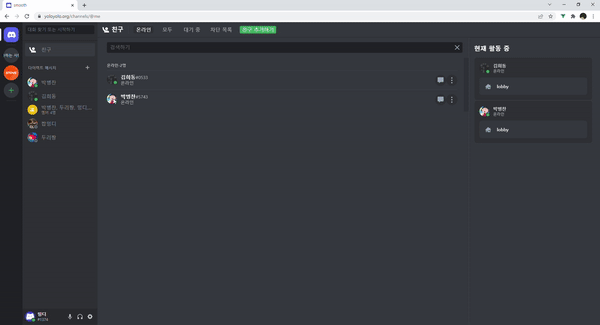 | 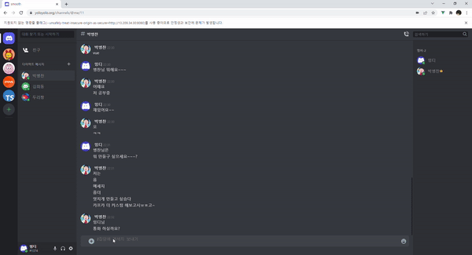 |
| ------------------------------------------------------------ | -------------------------------------------------------- | -------------------------------------------------------------- |
| 1:1DM                                                        | 그룹DM                                                   | DM 통화 및 채팅                                                |

### 메시지 알림

|  |  |
| --------------------------------------------------- | -------------------------------------------------- |
| DM UI                                               | DM FCM                                             |

### 커뮤니티 초대

| 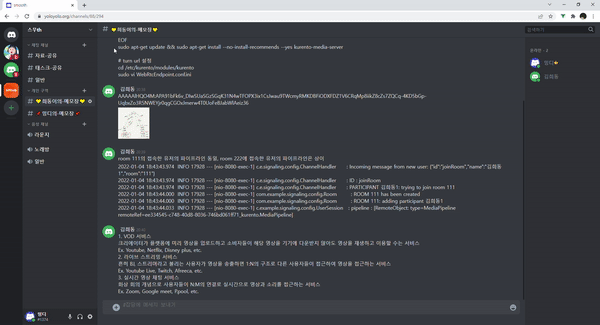 |  |
| --------------------------------------------------- | -------------------------------------------------------------- |
| 초대하기                                            | 초대받고 커뮤니티 입장하기                                     |

### 커뮤니티

| 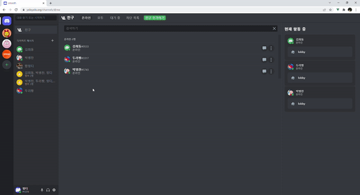 | 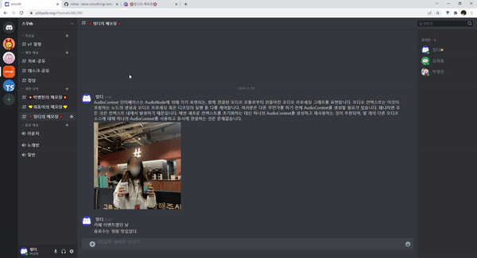 | 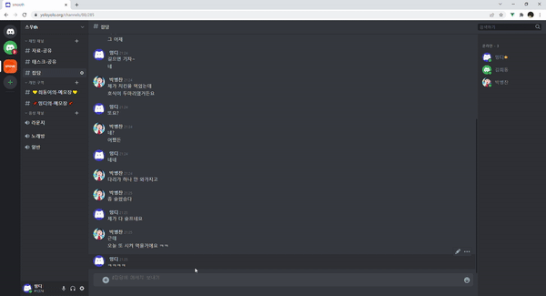 |
| ----------------------------------------------------------------------------------------- | --------------------------------------------------------------- | ---------------------------------------------------------------------------- |
| 커뮤니티,카테고리, 채널 생성하기, drag and drop                                           | 커뮤니티,카테고리, 채널 편집, 수정하기                          | 커뮤니티 자유로운 채팅                                                       |

### 실시간 상태 관리

| 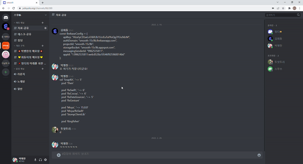 | 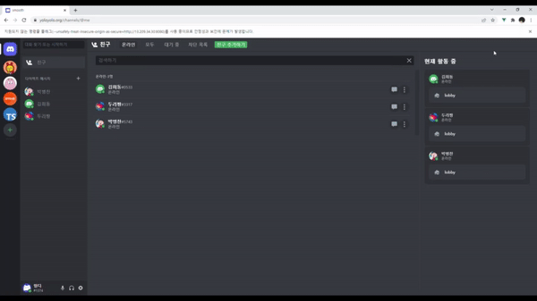 | 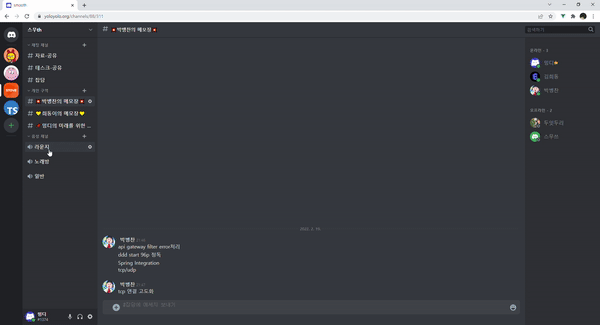 |
| ---------------------------------------------------- | ---------------------------------------------------------- | ------------------------------------------------------------------- |
| 타이핑 상태                                          | 내친구의 활동상태                                          | 음성채널 참가 멤버                                                  |

|  | 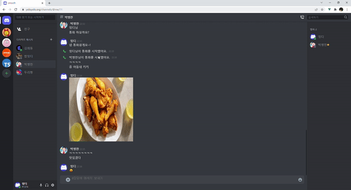 | 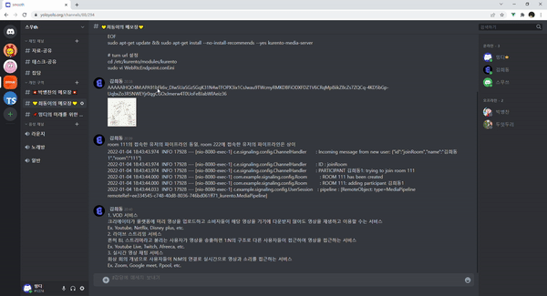 |
| -------------------------------------------------------------- | ------------------------------------------------------------------- | --------------------------------------------------------------------------------- |
| smooth 접속                                                    | dm방에서 멤버 접속 확인                                             | 커뮤니티 채팅방 멤버 접속 확인                                                    |
