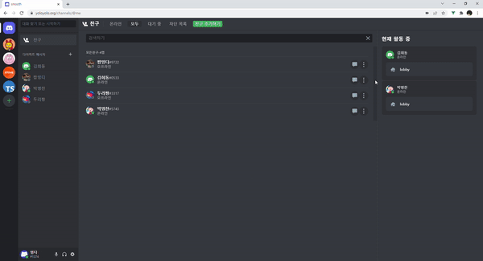
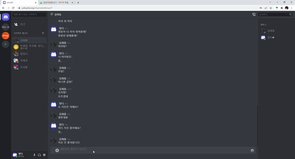
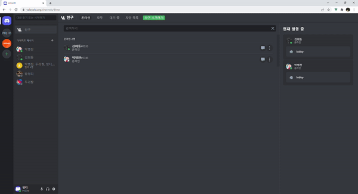
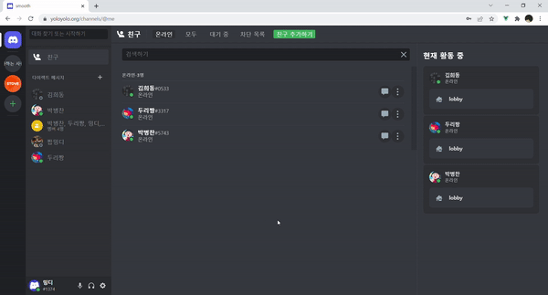
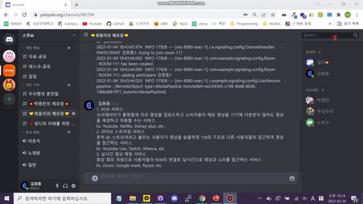

# 🔈Smooth

기술 스택

  
  
  
   
  
  

 

### 로그인/회원가입

|  |  |
| ---------------------------- | --------------------------------- |
| 로그인                       | 회원가입                          |

 

### 친구관리

|  |  |  |
| ----------------------------------- | -------------------------------------- | ------------------------------------- |
| 친구추가                            | 친구수락                               | 친구차단                              |

 

### 친구 추가기능

|  |  |
| ----------------------------------------------------------- | ------------------------------------------------ |
| 친구에게 메시지 걸기                                        | 친구에게 전화걸기                                |

 

### DM

|  |  |  |  |
| ----------------------------------------------- | ------------------------------------------- | -------------------------------------- | ------------------------------------- |
| 1:1DM                                           | 그룹DM                                      | DM UI                                  | DM FCM                                |
